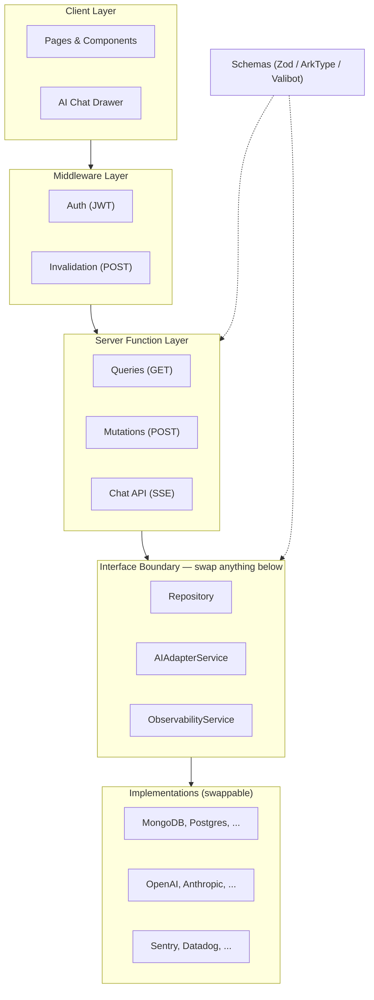
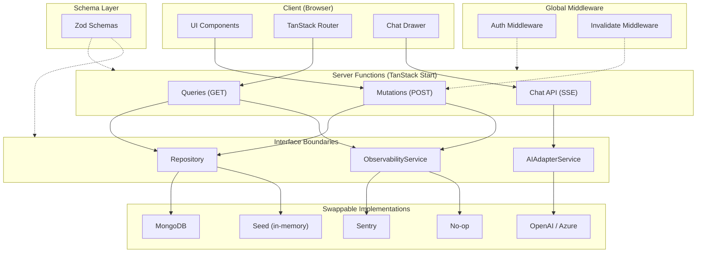

# TanStack AI-Promptable Full-Stack Template

A production-ready full-stack starter template for building **AI-promptable** internal tools and web applications.

Built with [TanStack Start](https://tanstack.com/start) — with every external service behind an interface so you can swap implementations without touching application code.

**Default stack**: [Mantine](https://mantine.dev/) + [MongoDB](https://www.mongodb.com/) + [TanStack AI](https://tanstack.com/ai) (OpenAI) + [Sentry](https://sentry.io/). All swappable.

**[Live Demo](https://leafy-manatee-16b96c.netlify.app)** | **[Blog Post](building-ai-promptable-fullstack-apps.md)**

## Quick Start

```bash
# Clone the template
git clone https://github.com/carlosvin/tanstack-fullstack-ai-template.git
cd tanstack-fullstack-ai-template

# Install dependencies
pnpm install

# Start the dev server (uses in-memory seed data, no DB required)
pnpm dev
```

Open [http://localhost:3000](http://localhost:3000). The app works immediately with seed data — no database, no API keys, no configuration needed.

## Install The Skill (npx skills)

You can install this repository's generated Agent Skill directly from GitHub:

```bash
# List skills available in this repository
npx skills add carlosvin/tanstack-fullstack-ai-template --list

# Install the TanStack fullstack pattern skill
npx skills add carlosvin/tanstack-fullstack-ai-template --skill tanstack-fullstack-pattern

# Optional: install globally (available across projects)
npx skills add carlosvin/tanstack-fullstack-ai-template --skill tanstack-fullstack-pattern -g

# Optional: verify installed skills
npx skills list
```

The skill is published in the standard location used by the CLI:

- `.agents/skills/tanstack-fullstack-pattern/SKILL.md`

## Architecture

The architecture is organized in layers with clear interface boundaries. The interfaces are the contract — the implementations are your choice.

### High-Level Overview



### Detailed Data Flow



### Swappable Layers

| Layer | Interface | Default | Alternatives |
|-------|-----------|---------|-------------|
| **Database** | `ReadRepository` / `WritableRepository` | [MongoDB](https://www.mongodb.com/) | [Postgres](https://www.postgresql.org/), [DynamoDB](https://aws.amazon.com/dynamodb/), [Supabase](https://supabase.com/), in-memory |
| **AI Provider** | `AIAdapterService` | [OpenAI](https://platform.openai.com/) (Azure) | [Anthropic](https://www.anthropic.com/), [Gemini](https://ai.google.dev/), [Ollama](https://ollama.com/), any OpenAI-compatible |
| **Observability** | `ObservabilityService` | [Sentry](https://sentry.io/) | [Datadog](https://www.datadoghq.com/), [OpenTelemetry](https://opentelemetry.io/), no-op |
| **UI Library** | — (component layer) | [Mantine](https://mantine.dev/) | [MongoDB.design](https://www.mongodb.design/), [shadcn/ui](https://ui.shadcn.com/), [Chakra](https://chakra-ui.com/), [Ant Design](https://ant.design/), [Radix](https://www.radix-ui.com/) |
| **Schema Validation** | — ([Standard Schema](https://github.com/standard-schema/standard-schema) spec) | [Zod](https://zod.dev/) | [ArkType](https://arktype.io/), [Valibot](https://valibot.dev/), [Effect Schema](https://effect.website/docs/schema/introduction/) |

**Schema library note:** [ArkType](https://arktype.io/) is a very good alternative to Zod (and many prefer its syntax). This template uses Zod because it is more widely known and has broad ecosystem support. With Zod v4 you can attach extra metadata to fields—e.g. formatting or units—which helps both UI rendering and AI tool hints; the same idea applies if you swap to ArkType or another schema library.

### Key Design Decisions

- **Repository Pattern**: All data access goes through an interface. A seed implementation ships for development; swap to MongoDB (or anything else) via environment variable.
- **Auth via Middleware**: A global TanStack Start middleware extracts JWT identity from headers and provides typed `AuthContext` to every server function. Mutations additionally use function-level `requireAuthMiddleware` so only POST server functions require authentication; queries stay unauthenticated.
- **Invalidation Middleware**: All POST server functions chain `invalidateMiddleware`, which calls `router.invalidate()` on the client after mutations. Components never invalidate manually. The AI chat uses an `invalidateRouter` client tool for the same purpose.
- **Task CRUD UI**: Add, edit, and delete tasks from the list and detail pages. Only the task creator can edit or delete; anyone logged in can create. Buttons are gated by auth and creator checks.
- **Promptable by Default**: AI tools call the same server functions that the UI uses — a single code path for validation, auth, and data access. Read and mutation tools go through the shared `createSafeServerTool()` helper so errors still return `{ error, code }` without repeating wrapper logic in every tool. A **getCurrentUserContext** tool lets the AI check who is logged in and what they can do. When the user is not allowed, tools return errors with 401/403 so the AI can inform the user. [Client tools](https://tanstack.com/ai/latest/docs/guides/client-tools) (`navigate`, `invalidateRouter`) run in the browser via `@tanstack/ai-client`.
- **URL-Aware AI Prompt**: The chat request includes browser context and current location (`currentPathname`, `currentSearch`, `currentHref`). The system prompt includes this as `Current Location` context and uses route-pattern guidance (for example `/tasks/$taskId` -> `/tasks/<taskId>`) so references like "this task" resolve to the page in view.
- **Observability as a Plugin**: Behind an `ObservabilityService` interface. No DSN configured? A no-op implementation is used. Want Datadog? Implement the interface.
- **Schemas = Source of Truth**: Every domain type is a schema with `.describe()` metadata. Types are inferred, JSON Schemas flow to AI tools automatically.
- **URL-as-State**: Page state (filters, selections, tabs) lives in URL search params, not component state. Shareable, bookmarkable, survives refresh.
- **Loaders-First**: Data is fetched in route loaders, never in `useEffect` + `useState`. Loaders provide caching, SSR, and parallel fetching for free.
- **E2E Tests Against Seed Data**: Playwright tests run against the dev server with `REPOSITORY_TYPE=seed`. An unsigned JWT fixture provides authenticated browser contexts. Tests cover dashboard, task list, task detail, and full CRUD — all without a real database.

## Project Structure

```
src/
├── start.ts                    # Global middleware registration
├── router.tsx                  # Router + client observability
├── middleware/
│   ├── auth.ts                 # JWT → AuthContext
│   ├── requireAuth.ts          # Function middleware for mutations (401 if not logged in)
│   └── invalidate.ts           # POST → router.invalidate()
├── routes/                     # File-based routes (pages)
├── components/                 # React components
├── services/
│   ├── schemas/schemas.ts      # Zod schemas (single source of truth)
│   ├── repository/             # Interface + Seed + Mongo implementations
│   ├── api/serverFns.ts        # Server functions (TanStack Start)
│   ├── ai/
│   │   ├── types.ts            # AIAdapterService interface
│   │   ├── adapter.ts          # OpenAI implementation + factory
│   │   └── tools.ts            # AI tool definitions
│   ├── observability/
│   │   ├── types.ts            # ObservabilityService interface
│   │   ├── sentry.ts           # Sentry implementation
│   │   ├── noop.ts             # No-op implementation
│   │   └── index.ts            # Factory
│   └── db/mongoClient.ts       # MongoDB singleton
├── utils/
│   ├── auth.ts                 # requireAuth(), requireGroup()
│   ├── httpError.ts            # HttpError class
│   └── jwt.ts                  # JWT decode
├── constants/                  # Shared enums
└── test-utils/                 # Vitest helpers

e2e/                               # Playwright E2E tests
├── auth.ts                        # Unsigned JWT helper + authenticated fixtures
├── dashboard.spec.ts
├── tasks-list.spec.ts
├── task-detail.spec.ts
└── task-crud.spec.ts
```

## Environment Variables

See [`.env.example`](.env.example) for the full list with documentation.

| Variable | Required | Default | Description |
|----------|----------|---------|-------------|
| `MONGODB_URI` | No | — | MongoDB connection string. If absent, seed repo is used. |
| `MONGODB_DB_NAME` | No | `app-db` | Database name. |
| `REPOSITORY_TYPE` | No | auto | `seed` or `mongo`. Auto-detected from `MONGODB_URI`. |
| `AZURE_OPENAI_API_KEY` | No | — | OpenAI API key. AI chat is disabled without it. |
| `AZURE_OPENAI_ENDPOINT` | No | — | OpenAI base URL (e.g., `https://host/openai/v1`). |
| `AZURE_OPENAI_DEPLOYMENT` | No | `gpt-4o` | Model deployment name. |
| `VITE_SENTRY_DSN` | No | — | Sentry DSN. Observability disabled without it. |
| `AUTH_HEADER_NAME` | No | `Authorization` | HTTP header containing the JWT. |

## Extending the Template

### Adding a New Entity (End-to-End)

1. **Schema**: Add Zod schemas in `src/services/schemas/schemas.ts` with `.describe()` on every field.
2. **Repository**: Add methods to the `ReadRepository` and/or `WritableRepository` interfaces in `types.ts`. Implement in both `seedRepository.ts` and `mongoRepository.ts`.
3. **Server Functions**: Add `createServerFn` wrappers in `src/services/api/serverFns.ts`. Chain `.middleware([invalidateMiddleware])` on mutations.
4. **AI Tools**: Expose methods as tools in `src/services/ai/tools.ts` that call your server functions through `createSafeServerTool()`. Update the system prompt.
   - Keep `src/services/ai/navigationManifest.ts` aligned with routes (including dynamic segments like `/tasks/$taskId`).
   - Ensure chat requests include current URL context in `browserContext` so the prompt can reason about the current page.
5. **Routes**: Create route files under `src/routes/`. Use loaders to fetch data.
6. **Tests**: Write unit tests for the seed repository and E2E tests in `e2e/` for the new routes.

### Swapping the Database

Replace `mongoRepository.ts` with your implementation of the `Repository` interface. Update the factory in `getRepository.ts`.

### Swapping the AI Provider

Create a new class implementing `AIAdapterService` from `src/services/ai/types.ts`. Update the factory in `adapter.ts`.

### Swapping Observability

1. Create a new class implementing `ObservabilityService` from `src/services/observability/types.ts`.
2. Update the factory in `src/services/observability/index.ts`.
3. Update `instrument.server.mjs` for server-side init.

### Swapping the UI Library

Replace Mantine imports in components. The architectural layers (repository, server functions, middleware) are unaffected.

## Scripts

```bash
pnpm dev        # Start dev server on port 3000
pnpm build      # Production build
pnpm start      # Run production server
pnpm test       # Run unit tests (Vitest)
pnpm test:e2e   # Run E2E tests (Playwright, uses seed data)
pnpm lint       # Lint + typecheck (Biome)
pnpm format     # Auto-format (Biome)
pnpm skills:build  # Generate Cursor + markdown skill artifacts
pnpm skills:check  # Validate canonical skills and check for drift
```

## Docker

```bash
docker build -t my-app .
docker run --rm -p 3000:3000 my-app
```

## Tech Stack

- **Framework**: [TanStack Start](https://tanstack.com/start) (full-stack React with SSR)
- **Routing**: [TanStack Router](https://tanstack.com/router) (file-based, type-safe)
- **AI**: [TanStack AI](https://tanstack.com/ai) (multi-provider, tool calling)
- **UI**: [Mantine](https://mantine.dev/) (component library + hooks)
- **Database**: [MongoDB](https://www.mongodb.com/) (via repository pattern)
- **Validation**: [Zod](https://zod.dev/) (schemas as source of truth)
- **Auth**: [jose](https://github.com/panva/jose) (JWT decode, any JS runtime)
- **Observability**: [Sentry](https://sentry.io/) (behind interface, optional)
- **Testing**: [Vitest](https://vitest.dev/) + [Testing Library](https://testing-library.com/) (unit), [Playwright](https://playwright.dev/) (E2E)
- **Linting**: [Biome](https://biomejs.dev/)
- **Server**: [Nitro](https://nitro.build/) (universal JavaScript server)

## Using This Template

### Option A: Clone and Build (New Project)

```bash
git clone https://github.com/carlosvin/tanstack-fullstack-ai-template.git my-app
cd my-app
rm -rf .git && git init    # Start fresh git history
pnpm install
pnpm dev                   # Works immediately with seed data
```

Then follow the end-to-end workflow:

1. Define your domain schemas in `src/services/schemas/schemas.ts` (Zod schemas with `.describe()` on every field, types inferred via `z.infer<>`)
2. Define your repository interface in `src/services/repository/types.ts` (`ReadRepository` + `WritableRepository`)
3. Implement the seed repository in `seedRepository.ts` (in-memory data for development)
4. Add server functions in `src/services/api/serverFns.ts` (GET for loaders, POST with `invalidateMiddleware` for mutations)
5. Expose methods as AI tools in `src/services/ai/tools.ts` that call your server functions through `createSafeServerTool()`
6. Create file-based routes under `src/routes/` (data in loaders, state in URL search params)
7. When ready for real data, implement `mongoRepository.ts` and set `MONGODB_URI`

### Option B: AI-Assisted via Generated Skill (New or Existing Project)

The skill is defined once in a canonical YAML source and generated into the [agentskills.io](https://agentskills.io) standard at `.agents/skills/tanstack-fullstack-pattern/`. Windsurf and other compatible tools read this path directly.

The generated outputs are committed intentionally so you can copy the skill into another project or tool without running the build pipeline first. The machine-readable metadata lives in `skills/registry.json`, and the portable markdown copy lives in `skills/dist/`.

**Use the skill in this repo:** clone the template — the skill is at `.agents/skills/tanstack-fullstack-pattern/`.

**Install the skill globally** (available in all your projects):

Run this one-liner in your terminal to automatically download and install the skill into the global directories for Cursor, Windsurf, and Claude Code:

```bash
curl -sL https://raw.githubusercontent.com/carlosvin/tanstack-fullstack-ai-template/main/scripts/skills/install.sh | bash -s -- --force
```

To manually install instead:

```bash
# Windsurf (reads .agents/skills/ when in repo; for global copy)
cp -r .agents/skills/tanstack-fullstack-pattern ~/.codeium/windsurf/skills/

# Cursor (copy from shared standard)
cp -r .agents/skills/tanstack-fullstack-pattern ~/.cursor/skills/

# Claude Code (copy from shared standard)
cp -r .agents/skills/tanstack-fullstack-pattern ~/.claude/skills/
```

To regenerate after editing the canonical source:

```bash
pnpm skills:build
```

To verify the generated outputs are current:

```bash
pnpm skills:check
pnpm test:skills
```

To verify that your editor actually loaded the skill, ask the agent a direct pattern question such as:

- *"What are the rigid rules in the TanStack fullstack pattern?"*
- *"How should this project structure repository and observability services?"*

If the skill loaded correctly, the response should mention the interface-first boundaries, loaders-first data fetching, URL-as-state, and mutation invalidation conventions.

Once active, ask the agent to apply the pattern:

- *"Set up this project using the TanStack fullstack pattern"*
- *"Add the repository pattern to this existing app"*
- *"Migrate this project to use interface-first architecture"*

The skill covers:

- The 6 architectural layers and their boundaries
- All 4 interface contracts (`ReadRepository`/`WritableRepository`, `AIAdapterService`, `ObservabilityService`, `AuthContext`)
- Rigid rules (loaders-first, URL-as-state, schema-first types, invalidation middleware)
- Implementation choices (swap any layer: database, AI, UI, observability, schema library)
- A validation checklist to verify the pattern is correctly applied

Tool support note: the canonical metadata now tracks support targets and install mode per tool. The current target tools are Windsurf (`native`) plus Cursor and Claude Code (`copy`). Use `skills/registry.json` as the source of truth for current support status.

### Option C: Adopt Incrementally (Existing Project)

You don't need to adopt the whole pattern at once. Each layer is independently valuable:

1. **Schema layer** — Move types to a centralized schema file with `.describe()` metadata
2. **Repository interface** — Extract data access behind `ReadRepository`/`WritableRepository`
3. **Server functions** — Wrap repository calls with `createServerFn` and `processResponse()`
4. **Auth middleware** — Add global JWT extraction and typed `AuthContext`
5. **Observability interface** — Put monitoring behind `ObservabilityService`
6. **AI tools** — Expose read methods as tools for the chat assistant
7. **Route migration** — Move `useEffect` data fetching into loaders, `useState` into URL search params

## License

MIT
